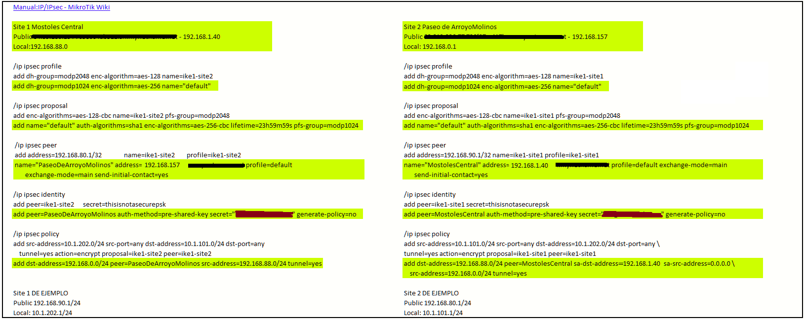
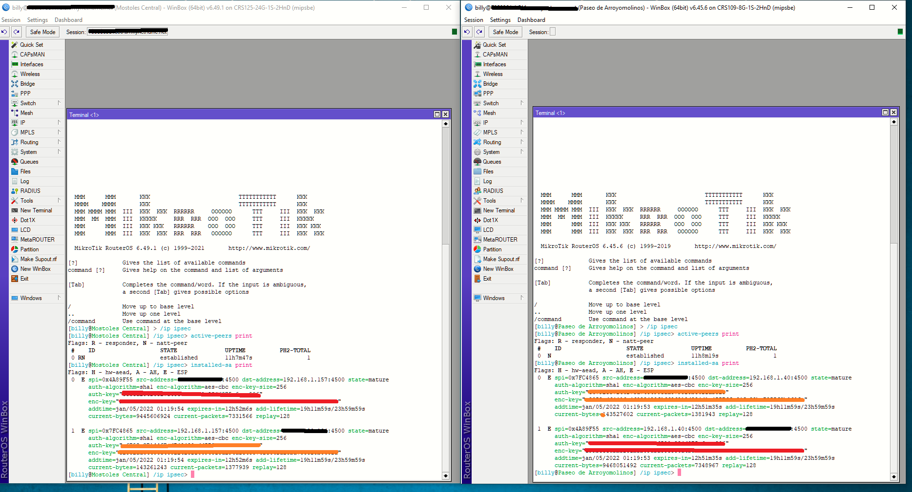

# Mikrotik IpSec

Site 1

Mostoles Central

Site 2 

Mostoles Paseo de Arroyo Molinos

## Configuración de las reglas del Firewall

## Configuración reglas de NAT

## Cámaras en site 1

## Cámaras en site 2

## Configuraciones para el IPSec

Lo que esta resaltado es la configuración realizadad, lo que no, lo que viene en el apartado: [Manual:IP/IPsec - MikroTik Wiki](https://wiki.mikrotik.com/wiki/Manual:IP/IPsec#Site_to_Site_IPsec_tunnel)

## Grabador con todas las cámaras

El grabador ahora debería ver las cámaras en el site 1 y 2, pero no ve las del site 2

No se ha abierto el puerto 8080, al parecer el ONVIF requiere este puerto aunque no se abra en el NAT.

# Comprobación final

Realizamos la siguiente comprobación en la Mikrotik

# Conclusión

Hemos unificado las redes de los dos comercios al sur de Madrid (Mostoles) de nuestro cliente, reutilizando los dos router Mikrotik que tiene en cada uno de ellos, hemos puesto un grabador en uno solo de los lugares y hemos dado de alta todas las cámaras para que un único grabador sea el que gestione el almacenamiento de videos de los dos comercios. 

